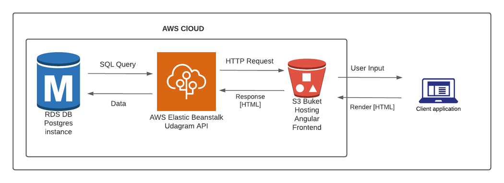

# Hosting a Full-Stack Application

In this project you will learn how to take a newly developed Full-Stack application built for a retailer and deploy it to a cloud service provider so that it is available to customers. You will use the aws console to start and configure the services the application needs such as a database to store product information and a web server allowing the site to be discovered by potential customers. You will modify your package.json scripts and replace hard coded secrets with environment variables in your code.

After the initial setup, you will learn to interact with the services you started on aws and will deploy manually the application a first time to it. As you get more familiar with the services and interact with them through a CLI, you will gradually understand all the moving parts.

You will then register for a free account on CircleCi and connect your Github account to it. Based on the manual steps used to deploy the app, you will write a config.yml file that will make the process reproducible in CircleCi. You will set up the process to be executed automatically based when code is pushed on the main Github branch.

The project will also include writing documentation covering the operations of the deployment process. Which will serve as a way to communicate with future developers and anybody involved in diagnosing outages of the Full-Stack application.

### Access Website

* Use this link: http://randombucket1234.s3-website-us-east-1.amazonaws.com/home to access the website.  

### Hosting

* This website is being hosted on AWS.
* Elastic Beanstalk is used for the Backend API.
* S3 bucket for the frontend and uploaded images.
* RDS database running Postgres.

### CI/CD pipeline
* The CircleCi is linked to the project on Github.
* It is used to automatically deploy the website to the AWS.
* It is set to automatically execute once the code is being pushed into the master Github project.

